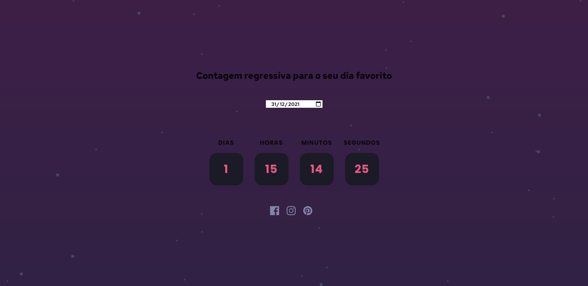

# Countdown timer

Criei esse pequeno projeto pra colocar em prática a combinação da manipulação do DOM juntamente com o uso da classe Date para criar um contador regressivo de acordo com a escolha de data do usuário.

## Visão Geral

- [Countdown timer](#countdown-timer)
  - [Visão Geral](#visão-geral)
  - [Resumo](#resumo)
    - [User Story](#user-story)
    - [Screenshot](#screenshot)
    - [Links](#links)
    - [Built with](#built-with)

**Note: Delete this note and update the table of contents based on what sections you keep.**

## Resumo

### User Story

Usuários deverão conseguir realizar as seguintes ações:

- Visualizar a mudanças nas cores dos icons ao passar o mouse por cima.
- Visualizar um contador regressivo de acordo com a escolha do usuário.

### Screenshot

### Links

- Live Site URL: [Add live site URL here](https://mbarbosasan.github.io/CountdownTimer/)

### Built with

- HTML5
- CSS3
- Flexbox
- JavaScript Vanilla
